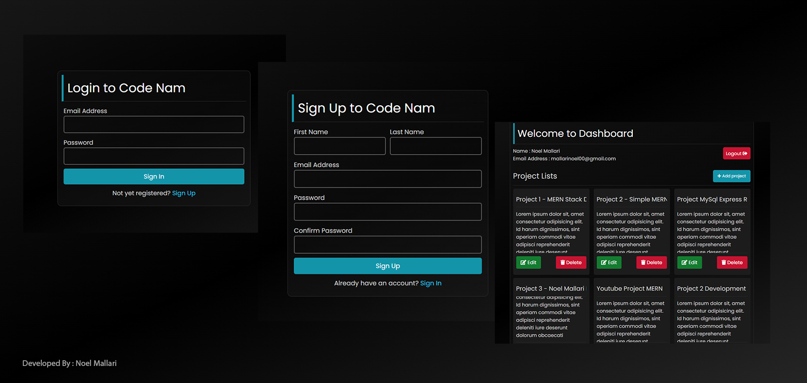

<h1 align="center">MERN - Create, Read, Update & Delete</h1>

MongoDB, Express, ReactJS & NodeJS [MERN] - CRUD with Login & Register.

# Preview

  

# Requirements
- 🧠 Brain
- 🕸 MongoDB  
- 📝Code Editor (`Vscode`, `Sublime Text`) 

# How to use?
- Step 1 : Download [NodeJS](https://nodejs.org/en/).
- Step 2 : Clone this repo or download the file manually.
- Step 3 : Open your code editor then locate the file/folder path 📁.
- Step 4 : If Step 3 is done, open your terminal and type `npm install` 😉.
- Step 5 : If you don't know how to do it, just have a sleep ✌.
- Step 6 : Don't forget to click the `star ⭐` from my repo.

If you have any questions about my repo you can contact me through my [facebook account](https://web.facebook.com/noel.mallari.5648137).

<h1 align="center">💌 Thank You! 💖</h1>
